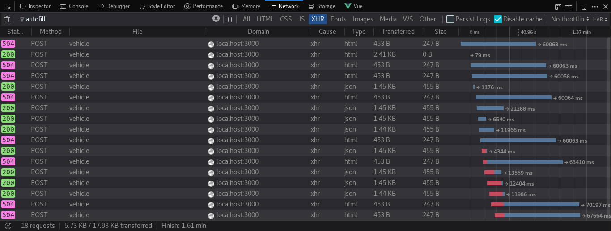
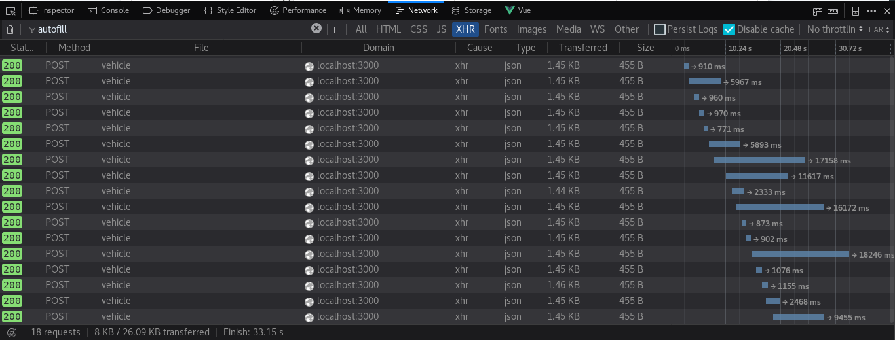

# Sinesp Cidadão PHP

<a href="https://packagist.org/packages/chapeupreto/sinesp"></img></a>
<a href="LICENSE"></img></a>
<a href="https://packagist.org/packages/chapeupreto/sinesp"></img></a>

<a href="https://packagist.org/packages/chapeupreto"></img></a>
<a href="https://twitter.com/chapeupreto"></img></a>
<a href="https://twitter.com/intent/tweet?text=Utilize%20Sinesp%20Cidadão%20agora!%20https%3A%2F%2Fgithub.com%2Fchapeupreto%2Fsinesp%20via%20%40chapeupreto&source=webclient"></img></a>

[SINESP Cidadão][1] é uma base de dados pública de veículos brasileiros muito útil para identificar carros ou motos roubados ou suspeitos.

# Sinesp PHP API Client

Infelizmente, o governo não mantém uma API pública para realizar esse tipo de consulta. Até então, a única maneira de visualizar as informações de um determinado veículo era através do site do Sinesp respondendo a perguntas de verificação (`captchas`) para cada uma das requisições. Assim, houve a necessidade de desenvolver uma API de modo a facilitar o acesso a essas informações.

# Informações Disponíveis

Se um veículo com a placa especificada for encontrado, o servidor irá retornar com as seguintes informações:

- *codigoRetorno*: código de retorno da consulta
- *mensagemRetorno*: mensagem de retorno da consulta
- *codigoSituacao*: código da situação do veículo
- *situacao*: mensagem da situação do veículo
- *modelo*: modelo do veículo
- *marca*: marca do veículo
- *cor*: cor do veículo
- *ano*: ano de fabricação do veículo
- *anoModelo*: ano do modelo do veículo
- *placa*: placa consultada
- *data*: data e hora da consulta
- *uf*: estado ou unidade federativa do veículo
- *municipio*: município ou cidade do veículo
- *chassi*: chassi do veículo
- *dataAtualizacaoCaracteristicasVeiculo*: data atualização das características do veículo
- *dataAtualizacaoRouboFurto*: data atualização de informações sobre roubo ou furto
- *dataAtualizacaoAlarme*:

Essas informações estarão disponíveis por meio de um `array associativo` ou como `atributo` do objeto.

# Requisitos

- PHP 5.4+
- cURL
- libxml / XML

# Instalação

Instale a versão mais recente com:

```sh
composer require chapeupreto/sinesp
```

# Utilização

Abaixo um exemplo simples e geral de utilização da biblioteca:

```php
<?php

require 'vendor/autoload.php';

use Sinesp\Sinesp;

$veiculo = new Sinesp;

try {
    $veiculo->buscar('GWW-6471');
    if ($veiculo->existe()) {
        print_r($veiculo->dados());
    }
} catch (\Exception $e) {
    echo $e->getMessage();
}
```

O método `buscar()` deve ser o primeiro método a ser invocado. Esse método é empregado para localizar informações do veiculo com a placa informada.

Após a chamada ao método `buscar()`, o método `dados()` irá retornar um array associativo contendo todas as informações do veículo.

Ainda, ao invés de utilizar todo o array retornado pelo método `dados()`, pode-se também recuperar uma informação isoladamente acessando-a como atributo do objeto:

```php
echo 'O municipio do veiculo é ', $veiculo->municipio;
```

## Proxy

O SINESP pode bloquear conexões vindas de fora do país.
Caso a consulta não retorne resultados por erro de conexão (por exemplo, erro de `timeout`), pode-se realizar uma consulta usando proxy.

Existem diversos proxy gratuitos (e.g., `http://proxylist.hidemyass.com/`) que podem ser encontrados facilmente na Internet. Um exemplo de utilização com proxy encontra-se abaixo:

```php
$veiculo = new Sinesp;
$veiculo->proxy('177.54.144.208', '80'); // Com proxy, esse metodo deve ser chamado antes do metodo buscar()

$veiculo->buscar('GWW-6471');
print_r($veiculo->dados());
```

Opcionalmente, ao invés de usar o metodo `proxy($ip, $porta)`, pode-se utilizar um array associativo com as chaves `ip` e `porta` como segundo argumento do método `buscar()`:

```php
$veiculo = new Sinesp;
$veiculo->buscar('GWW-6471', ['ip' => '177.54.144.208', 'porta' => '80']); // a consulta usara o proxy especificado

print_r($veiculo->dados());
```

## Timeout
Uma vez que o SINESP não mata sua requisição após bloqueio, é provável que você acabe se deparando com erro(s) 504. A fim de evitar transtorno, foi disponibilizado o método `timeout` para definir um tempo máximo de resposta:

```php
$veiculo->timeout(5); // tempo em segundos
```

*Dica:* Em combinação com o [proxy](#proxy) (fazendo múltiplas tentativas com diferentes proxies), isso poderá aumentar consideravelmente suas chances de sucesso para múltiplas requisições


*Com diferentes proxies, mas sem timeout*


*Com diferentes proxies e timeout*

# Agradecimentos

- [@victor-torres](https://github.com/victor-torres)
- [@ricardotominaga](https://github.com/ricardotominaga)
- [@ivanaugustobd](https://github.com/ivanaugustobd)

[1]: https://www.sinesp.gov.br/sinesp-cidadao "Sinesp Cidadão"
